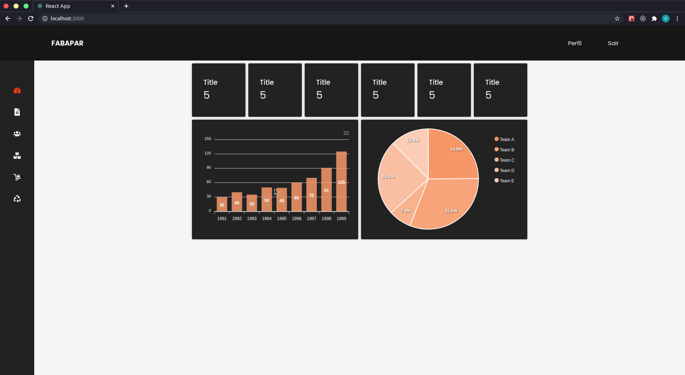
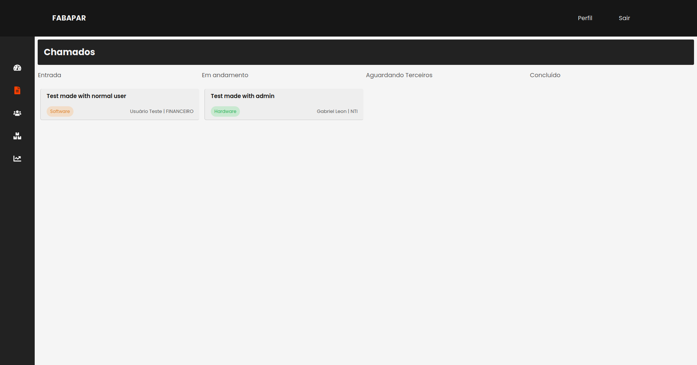

# Sistema de Gerênciamento do Setor de TI da FABAPAR

> Front-end simples e moderno com ReactJS & Redux.

License [MIT]

Este site é bem simples, usa ReactJS para composição da página, styled-components, react-icons, redux, entre outros.(_Em caso de dúvidas entrar em [contato][contato]._)




## Necessário para instalação

OS X & Linux & Windows:

-   Yarn/NPM
-   Node.js ^v12.18.2
-   > Comando para instalar os pacotes com Yarn

```sh
    yarn
```

> Comando para instalar os pacotes com NPM

```sh
    npm install
```

## Exemplo de uso

Roda o servidor para desenvolvimento

```sh
    yarn start
```

Cria os arquivos para produção

```sh
    yarn build
```

_Para mais informações acesse [Create-React-App][react-app]._

## Histórico de lançamentos

-   1.0.0
    -   Versão simples, com SASS.
    -   Font Awesome.
    -   Sem Redux ainda.
-   2.0.0
    -   Versão com Styled Components.
    -   React Icons.
    -   Não responsivo.
    -   Sem Redux.
-   3.0.0 (MVP)
    -   Versão com Styled Components e React Icons.
    -   Responsivo.
    -   Ainda sem Redux.

## Meta

Gabriel Leon – [@gabeleonn](https://linkedin.com/in/gabeleonn) – _[gableonn@gmail.com][contato]._

[https://github.com/gabeleonn/](https://github.com/gabeleonn/)

Distribuído sob a licença MIT. Entre em [contato][contato] para mais informações.

## Contributing

1. Faça o _fork_ do projeto (<https://github.com/gabeleonn/fabapar-client/fork>)
2. Crie uma _branch_ para sua modificação (`git checkout -b feature/fooBar`)
3. Faça o _commit_ (`git commit -m 'Type: Add some fooBar'`)
4. _Push_ (`git push origin feature/fooBar`)
5. Crie um novo _Pull Request_

[contato]: mailto:gableonn@gmail.com
[react-app]: https://create-react-app.dev/docs/getting-started/
